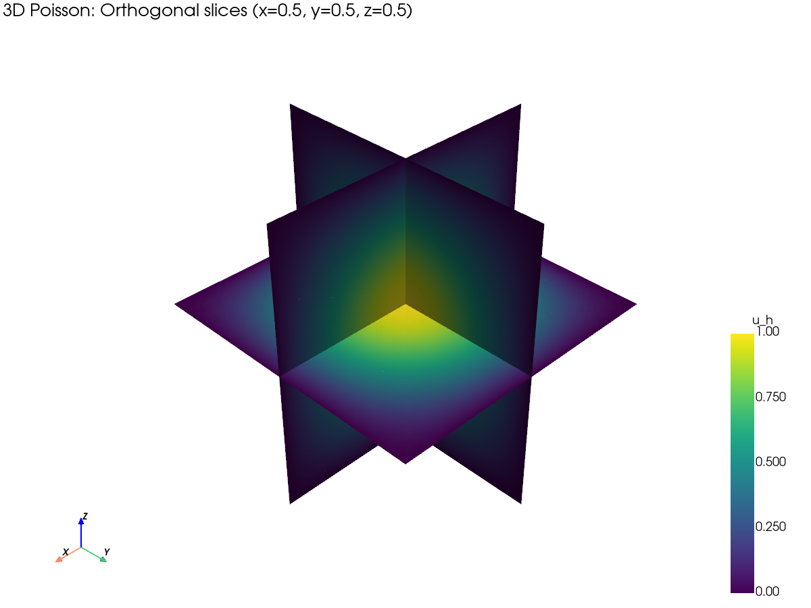
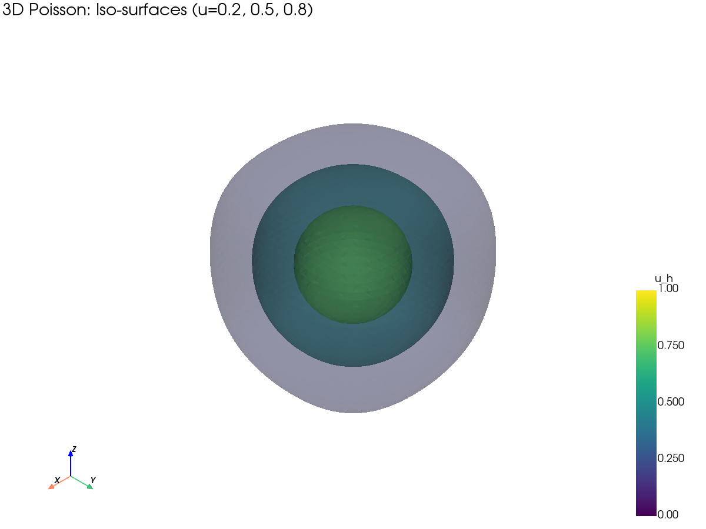

# dolfinx-mcp

MCP server for FEniCSx/DOLFINx finite element computing.

**Version**: 0.6.1 | **License**: MIT | **Python**: >= 3.10 | **DOLFINx**: 0.10.0

Exposes 31 tools, 6 prompt templates, and 6 resources for mesh generation,
function space creation, PDE solving, and post-processing through the
[Model Context Protocol](https://modelcontextprotocol.io/). Runs inside a
Docker container with the full DOLFINx/PETSc stack.

```
                     MCP Client                              Docker Container
               (Claude, Cursor, ...)                      (dolfinx/dolfinx:stable)
              +---------------------+                    +-----------------------+
              |                     |    JSON-RPC         |  FastMCP Server       |
              |  "Solve the 3D     | ---- stdio -------> |    31 Tool Handlers   |
              |   Poisson equation" |    or HTTP          |    SessionState       |
              |                     | <------------------ |    /workspace output  |
              +---------------------+                    +-----------------------+
```

---

## Quick Start

### 1. Build

```bash
git clone https://github.com/estanley/ccFenics-plugin.git
cd ccFenics-plugin
docker build -t dolfinx-mcp .
```

### 2. Configure MCP Client

Add to your MCP client configuration (Claude Desktop, Cursor, VS Code, etc.):

```json
{
  "mcpServers": {
    "dolfinx": {
      "command": "docker",
      "args": [
        "run", "--rm", "-i", "--network", "none",
        "-v", "/tmp/dolfinx-workspace:/workspace",
        "dolfinx-mcp"
      ]
    }
  }
}
```

### 3. Use

Ask your AI assistant to solve a PDE -- the MCP tools handle the DOLFINx
operations inside the container:

> "Create a 16x16 unit square mesh and solve the Poisson equation
> with f = 2*pi^2*sin(pi*x)*sin(pi*y), then compute the L2 error."

---

## Example: 3D Poisson on Unit Cube

A Jupyter notebook demonstrating a full 3D workflow is at
[`examples/3d_poisson_demo.ipynb`](examples/3d_poisson_demo.ipynb).

**Problem**: $-\nabla^2 u = 3\pi^2 \sin(\pi x)\sin(\pi y)\sin(\pi z)$ on $[0,1]^3$, $u=0$ on boundary.

| Metric | Result |
|--------|--------|
| Mesh | 16x16x16 tetrahedra (24,576 cells, 4,913 vertices) |
| Space | P2 Lagrange (35,937 DOFs) |
| Solver | CG + Hypre AMG |
| max(u_h) | 1.000056 (expected 1.0) |
| L2 error | 1.21e-05 |
| H1 error | 1.15e-03 |

**Orthogonal slices through the solution field at x=0.5, y=0.5, z=0.5:**



**Iso-surfaces at u = 0.2, 0.5, 0.8 (nested concentric level sets):**



---

## Tools (31)

### Mesh Operations (9)

| Tool | Description |
|------|-------------|
| `create_unit_square` | Unit square mesh with triangular or quadrilateral elements |
| `create_mesh` | Rectangle or box meshes with custom dimensions |
| `create_custom_mesh` | Import mesh from Gmsh (.msh) file |
| `get_mesh_info` | Inspect mesh properties (cells, vertices, bounding box) |
| `compute_mesh_quality` | Mesh quality metrics (aspect ratio, volume) |
| `mark_boundaries` | Tag boundary facets using coordinate expressions |
| `manage_mesh_tags` | Create and manage cell/facet region markers |
| `refine_mesh` | Uniformly refine an existing mesh |
| `create_submesh` | Extract submesh from tagged regions |

### Function Spaces (2)

| Tool | Description |
|------|-------------|
| `create_function_space` | Lagrange, DG, Nedelec, RT, BDM, or CR elements (degree 1-5) |
| `create_mixed_space` | Mixed function space from component subspaces |

### Problem Definition (3)

| Tool | Description |
|------|-------------|
| `set_material_properties` | Define material coefficients and source terms |
| `define_variational_form` | Bilinear and linear forms via UFL expressions |
| `apply_boundary_condition` | Dirichlet boundary conditions (value + locator) |

### Solvers (3)

| Tool | Description |
|------|-------------|
| `solve` | Direct (LU, MUMPS) or iterative (CG, GMRES) with preconditioners |
| `solve_time_dependent` | Time stepping: backward/forward Euler, Crank-Nicolson |
| `get_solver_diagnostics` | Convergence info, iterations, residual norms |

### Post-processing (6)

| Tool | Description |
|------|-------------|
| `compute_error` | L2 or H1 error against an exact solution |
| `evaluate_solution` | Evaluate solution at specified coordinates |
| `query_point_values` | Point queries with geometric cell info |
| `compute_functionals` | Integrate UFL expressions over the domain |
| `export_solution` | Export to XDMF or VTK format |
| `plot_solution` | Contour or warp plots (PNG via PyVista) |

### Interpolation (3)

| Tool | Description |
|------|-------------|
| `interpolate` | Interpolate UFL expression into a function space |
| `project` | L2-project an expression onto a function space |
| `create_discrete_operator` | Build a discrete operator matrix |

### Session Management (5)

| Tool | Description |
|------|-------------|
| `get_session_state` | List all registered meshes, spaces, functions, solutions |
| `reset_session` | Clear all session state |
| `run_custom_code` | Execute Python code in the session namespace |
| `assemble` | Assemble UFL forms into scalars, vectors, or matrices |
| `remove_object` | Remove an object with cascade deletion of dependents |

---

## Prompt Templates (6)

Built-in workflow guides accessible via MCP prompt protocol:

| Prompt | Description |
|--------|-------------|
| `setup_poisson` | Guided Poisson equation setup (-div(grad u) = f) |
| `setup_elasticity` | Linear elasticity problem workflow |
| `setup_stokes` | Stokes flow problem with mixed elements |
| `setup_navier_stokes` | Navier-Stokes with time stepping |
| `debug_convergence` | Diagnose solver convergence failures |
| `convergence_study` | h-refinement convergence rate study |

---

## Resources (6)

URI-addressable resources for MCP resource protocol:

| URI | Content |
|-----|---------|
| `dolfinx://capabilities` | Element families, solvers, export formats |
| `dolfinx://mesh/schema` | JSON schema for mesh objects |
| `dolfinx://space/schema` | JSON schema for function space objects |
| `dolfinx://solution/schema` | JSON schema for solution objects |
| `dolfinx://session/overview` | Current session state summary |
| `dolfinx://solver/options` | Available solver and preconditioner options |

---

## Transport Modes

| Mode | Command | Use Case |
|------|---------|----------|
| **stdio** (default) | `docker run --rm -i dolfinx-mcp` | CLI clients, Claude Desktop |
| **streamable-http** | `docker run -p 8000:8000 dolfinx-mcp --transport streamable-http --host 0.0.0.0` | Web clients, JupyterLab |
| **sse** | `docker run -p 8000:8000 dolfinx-mcp --transport sse --host 0.0.0.0` | Legacy SSE clients |

---

## JupyterLab Integration

Start with Docker Compose:

```bash
docker-compose -f docker-compose.lab.yml up --build
# Open http://localhost:8888
```

Or install the extension directly:

```bash
pip install dolfinx-mcp[jupyter]
```

Use IPython magics inside JupyterLab:

```python
%load_ext dolfinx_mcp_jupyter

%mcp_config url=http://localhost:8000/mcp

%mcp create_unit_square name=mesh nx=16 ny=16
%mcp create_function_space name=V family=Lagrange degree=1
%mcp solve solver_type=direct
%mcp compute_error exact="sin(pi*x[0])*sin(pi*x[1])" norm_type=L2
```

---

## Design-by-Contract

All 31 tools enforce runtime contracts:

- **Preconditions**: Input validation (parameter types, ranges, existence checks)
- **Postconditions**: Output validation (return structure, value constraints)
- **Invariants**: 7 referential integrity invariants on SessionState

Contract violations return structured error responses:

```json
{
  "error": "PRECONDITION_VIOLATED",
  "message": "Mesh 'box' not found in session",
  "suggestion": "Create a mesh first with create_unit_square or create_mesh"
}
```

Error codes: `NO_ACTIVE_MESH`, `MESH_NOT_FOUND`, `FUNCTION_SPACE_NOT_FOUND`,
`FUNCTION_NOT_FOUND`, `INVALID_UFL_EXPRESSION`, `SOLVER_ERROR`, `DUPLICATE_NAME`,
`DOLFINX_API_ERROR`, `FILE_IO_ERROR`, `PRECONDITION_VIOLATED`,
`POSTCONDITION_VIOLATED`, `INVARIANT_VIOLATED`.

---

## Formal Verification (Lean 4)

The 7 referential integrity invariants of `SessionState` are formally verified
in Lean 4 with machine-checked proofs. Located in `.outline/proofs/DolfinxProofs/`.

**20 theorems, 4 helper lemmas, zero `sorry` placeholders.**

Key results:

| Theorem | What it proves |
|---------|---------------|
| `freshState_valid` | Empty session satisfies all 7 invariants |
| `registerMesh_valid` | Adding a mesh preserves invariants |
| `registerFunctionSpace_valid` | Adding a function space preserves invariants |
| `removeMesh_valid` | **Cascade deletion** of mesh + dependents preserves invariants |
| `removeSpaceDeps_valid` | Removing space dependents preserves invariants |
| `cleanup_valid` | Session reset produces a valid state |
| `validateOutputPath_safe` | Output path validation is a containment check |
| `errorCodeString_injective` | All 13 error codes are pairwise distinct |

Verify locally (requires [Lean 4](https://leanprover.github.io/lean4/doc/quickstart.html)):

```bash
cd .outline/proofs/DolfinxProofs
lake build    # exits 0, zero warnings
```

---

## Development

### Setup

```bash
pip install -e ".[dev]"
```

### Commands

```bash
# Unit tests (no Docker required, 238 tests)
pytest tests/ --ignore=tests/test_runtime_contracts.py -v

# Docker integration tests
docker build -t dolfinx-mcp .
pytest tests/test_runtime_contracts.py -v

# Production readiness suite (all 31 tools via MCP protocol)
python examples/production_readiness.py --verbose

# Lint
ruff check src/ tests/ examples/
```

### Project Structure

```
src/dolfinx_mcp/
    server.py              Entry point
    _app.py                FastMCP instance + lifespan
    session.py             SessionState (8 registries, 7 invariants)
    errors.py              12 error classes + decorator
    ufl_context.py         Restricted UFL expression evaluation
    tools/
        mesh.py            9 mesh tools
        spaces.py          2 function space tools
        problem.py         3 problem definition tools
        solver.py          3 solver tools
        postprocess.py     6 post-processing tools
        interpolation.py   3 interpolation tools
        session_mgmt.py    5 session management tools
    prompts/templates.py   6 workflow prompts
    resources/providers.py 6 URI resources

src/dolfinx_mcp_jupyter/   JupyterLab extension (5 IPython magics)

tests/                     12 test files, 238 tests
examples/                  Production readiness suite + 3D Poisson notebook
.outline/proofs/           Lean 4 formal verification (20 theorems)
```

---

## License

MIT
